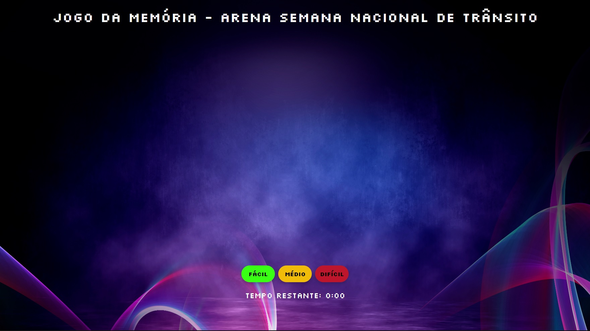

# Jogo da Memória - Arena Semana Nacional de Trânsito

  

Este é um projeto de um jogo da memória simples desenvolvido em HTML, CSS e JavaScript. O jogo apresenta cartas viradas para baixo e o jogador precisa encontrar pares correspondentes ao virar as cartas.

## Funcionalidades

- Embaralhamento aleatório das cartas no início do jogo.
- Contagem regressiva de tempo para adicionar desafio.
- Detecção de pares correspondentes.
- Janela de diálogo personalizada para vitória e tempo esgotado.
- Recarregamento da página após fechar a janela de diálogo.

## Como Jogar

1. Escolha a dificuldade clicando nos botões "Fácil", "Médio" ou "Difícil".
2. Encontre os pares correspondentes ao clicar nas cartas.
3. O jogo é vencido quando todos os pares são encontrados ou o tempo se esgota.

## Pré-requisitos

Para executar o jogo, você precisa de um navegador da web moderno que suporte HTML5, CSS3 e JavaScript.

## Instalação e Uso

1. Clone ou faça o download deste repositório.
2. Abra o arquivo `index.html` em um navegador da web.

## Desenvolvedores

Este projeto foi desenvolvido por:

- Ricardo Melo ([GitHub](https://github.com/ricardojs122))
- João Falcão ([GitHub](https://github.com/camalejao))

---

  <strong>Divirta-se jogando!</strong>

